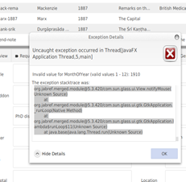
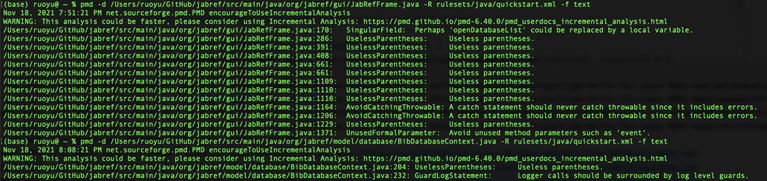
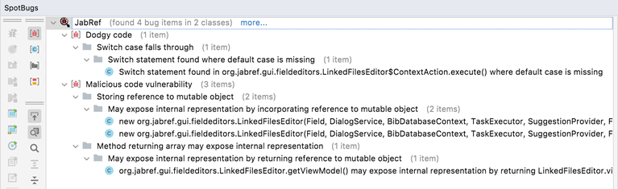

<!-- TOC -->
- [CS427 Group-9 Term Project Proposal](#cs427-group-9-term-project-proposal)
    - [Group Members](#group-members)
    - [Selected Projects](#selected-projects)
- [CS427 Project: Progress Report](#cs427-project-progress-report)
  - [Table: Test Scenario](#table-test-scenario)
  - [Table: Code Bug-Free](#table-code-bug-free)

<!-- /TOC -->

# CS427 Group-9 Term Project Proposal

### Group Members
Jimmy Rodriguez (jamesmr2), Jie Zheng (jzheng5), Anna Qian (ruoyuq2), Hao Yan (haoyan5), Seth Buchinger (sethlb2), Evan Pickett (evandp3), Alex Tcherniakhovski, Weidong Sun (weidong6)

### Selected Projects
* Anki-Android: [https://github.com/ankidroid/Anki-Android](https://github.com/ankidroid/Anki-Android)
* AWS Java SDK - [https://github.com/aws/aws-sdk-java](https://github.com/aws/aws-sdk-java)
* Nextcloud Android app - [https://github.com/nextcloud/android](https://github.com/nextcloud/android)
* Jsoup - [https://github.com/jhy/jsoup](https://github.com/jhy/jsoup)
* Jabref - [https://github.com/JabRef/jabref](https://github.com/JabRef/jabref)
* Telegram Bot - [https://github.com/rubenlagus/TelegramBots](https://github.com/rubenlagus/TelegramBots)
* NextCloud Notes - [https://github.com/stefan-niedermann/nextcloud-notes](https://github.com/stefan-niedermann/nextcloud-notes)

<table>
  <tr>
   <td>
<strong>Project Name</strong>
   </td>
   <td><strong>Compilable & Executable</strong>
   </td>
   <td><strong>Existing Test Suite</strong>
   </td>
   <td><strong>Popularity</strong>
   </td>
   <td><strong>Actively Maintained (Last Commit Time)</strong>
   </td>
   <td><strong>Open Github Issues</strong>
   </td>
   <td><strong>Contributing Guidelines</strong>
   </td>
  </tr>
  <tr>
   <td>Anki-Android
   </td>
   <td>Yes 
   </td>
   <td>Yes, 1,139 unit tests
   </td>
   <td>4.2K
   </td>
   <td>10/15/2021
   </td>
   <td>298
   </td>
   <td><a href="https://github.com/ankidroid/Anki-Android/blob/0b5a2e8b706db749affc2f6c5783a39c27edc62e/CONTRIBUTING.md">contributing guideline</a>
   </td>
  </tr>
  <tr>
   <td>AWS Java SDK
   </td>
   <td>Yes
   </td>
   <td>Yes
   </td>
   <td>3.6K
   </td>
   <td>10/15/2021
   </td>
   <td>140
   </td>
   <td><a href="https://github.com/aws/aws-sdk-java/blob/2e4467c6e87d6f4d6eecc3d6da51110bd71d1133/CONTRIBUTING.md">contributing guideline</a>
   </td>
  </tr>
  <tr>
   <td>Nextcloud Android app
   </td>
   <td>Yes 
   </td>
   <td>Yes
   </td>
   <td>2.6K
   </td>
   <td>10/15/2021
   </td>
   <td>843
   </td>
   <td><a href="https://github.com/nextcloud/android/blob/db46d46ab70fac14d14a916c21d28f4902d540f2/CONTRIBUTING.md">contributing guideline</a>
   </td>
  </tr>
  <tr>
   <td>Jsoup
   </td>
   <td>Yes
   </td>
   <td>Yes, 1061 unit tests
   </td>
   <td>9.1K
   </td>
   <td>10/19/2021
   </td>
   <td>66
   </td>
   <td>None
   </td>
  </tr>
  <tr>
   <td>Jabref
   </td>
   <td>Yes
   </td>
   <td>Yes, 7481 unit tests
   </td>
   <td>2.3k
   </td>
   <td>10/19/2021
   </td>
   <td>236
   </td>
   <td><a href="https://devdocs.jabref.org/contributing">Contributing guide</a>
   </td>
  </tr>
  <tr>
   <td>Telegram Bot
   </td>
   <td>Yes
   </td>
   <td>Yes, 230 unit tests
   </td>
   <td>2.6k
   </td>
   <td>07/04/2021
   </td>
   <td>110
   </td>
   <td><a href="https://github.com/rubenlagus/TelegramBots#contributions">Contributing guide</a>
   </td>
  </tr>
  <tr>
   <td>NextCloud Notes
   </td>
   <td>Yes
   </td>
   <td>Yes, 240 tests
   </td>
   <td>619
   </td>
   <td>10/23/2021
   </td>
   <td>30
   </td>
   <td><a href="https://github.com/stefan-niedermann/nextcloud-notes/blob/master/CONTRIBUTING.md">Contributing guide</a>
   </td>
  </tr>
</table>

<table>
  <tr>
   <td><strong>Project Name</strong>
   </td>
   <td><strong>Issue Links</strong>
   </td>
   <td><strong>Types of Issues (Bug or Feature)</strong>
   </td>
   <td><strong>Estimated Time to Fix Each Issue </strong>
   </td>
   <td><strong># of People Fixing the Issue (1 or 2)</strong>
   </td>
   <td>
    <strong>Estimated Difficulty (in a Scale of 1-5) </strong>
   </td>
  </tr>
  <tr>
      <td>Jsoup
   </td>
   <td><a href="https://github.com/jhy/jsoup/issues/953">Add Element.Before() method</a>
   </td>
   <td>Feature
   </td>
   <td>3 weeks
   </td>
   <td>2
   </td>
   <td>4
   </td>
  </tr>
  <tr>
   <td>Jsoup
   </td>
   <td><a href="https://github.com/jhy/jsoup/issues/1636">Add [contains|matches][own]Whole</a>
   </td>
   <td>Feature
   </td>
   <td>3 weeks
   </td>
   <td>2
   </td>
   <td>5
   </td>
  </tr>
  <tr>
   <td>Jsoup
   </td>
   <td><a href="https://github.com/jhy/jsoup/issues/1411">Add method to parse and create HTML element</a>
   </td>
   <td>Feature
   </td>
   <td>3 weeks
   </td>
   <td>2
   </td>
   <td>4
   </td>
  </tr>
  <tr>
   <td>Jabref
   </td>
   <td><a href="https://github.com/JabRef/jabref/issues/7986">Entry editor columns not well adjusted </a>
   </td>
   <td>Bug
   </td>
   <td>1 week
   </td>
   <td>2
   </td>
   <td>2
   </td>
  </tr>
  <tr>
   <td>AWS SDK
   </td>
   <td><a href="https://github.com/aws/aws-sdk-java/issues/2603">unable to use amazon sdk via corporate proxy with self-signed certificates</a>
   </td>
   <td>Feature
   </td>
   <td>3 weeks
   </td>
   <td>2
   </td>
   <td>4
   </td>
  </tr>
  <tr>
   <td>AWS SDK
   </td>
   <td><a href="https://github.com/aws/aws-sdk-java/issues/1079">Generated hashCode() should be improved </a>
   </td>
   <td>Feature
   </td>
   <td>2 weeks
   </td>
   <td>2
   </td>
   <td>3
   </td>
  </tr>
  <tr>
   <td>Jabref
   </td>
   <td><a href="https://github.com/JabRef/jabref/issues/8096 ">Empty entry in JabRef leads to Error when compiling in LaTeX</a>
   </td>
   <td>Feature
   </td>
   <td>2 weeks
   </td>
   <td>2
   </td>
   <td>4
   </td>
  </tr>
  <tr>
   <td>Jabref
   </td>
   <td><a href="https://github.com/JabRef/jabref/issues/8127 ">Invalid DOI should not show "Connection error"</a>
   </td>
   <td>Feature
   </td>
   <td>3 weeks
   </td>
   <td>2
   </td>
   <td>4
   </td>
  </tr>
  <tr>
   <td>Jabref
   </td>
   <td><a href="https://github.com/JabRef/jabref/issues/8133 ">Default save order should be "Keep original order"</a>
   </td>
   <td>Feature
   </td>
   <td>2 weeks
   </td>
   <td>2
   </td>
   <td>3
   </td>
  </tr>
  <tr>
   <td>Anki-Android
   </td>
   <td><a href="https://github.com/ankidroid/Anki-Android/issues/9097">Expand crash report to note disk free/total reporting</a>
   </td>
   <td>Feature
   </td>
   <td>2 weeks
   </td>
   <td>2
   </td>
   <td>4
   </td>
  </tr>
  <tr>
   <td>Anki-Android
   </td>
   <td><a href="https://github.com/ankidroid/Anki-Android/issues/5844">Feature: Forgotten AnkiWeb Email Instructions</a>
   </td>
   <td>Featre
   </td>
   <td>1 week
   </td>
   <td>2
   </td>
   <td>2
   </td>
  </tr>
  <tr>
   <td>Nextcloud Notes
   </td>
   <td><a href="https://github.com/stefan-niedermann/nextcloud-notes/issues/1306">Add option to show category (and content?) in Notes List Widget</a>
   </td>
   <td>Feature
   </td>
   <td>3 weeks
   </td>
   <td>2
   </td>
   <td>5
   </td>
  </tr>
  <tr>
   <td>Nextcloud Android app
   </td>
   <td><a href="https://github.com/nextcloud/android/issues/8778">Gallery Folders</a>
   </td>
   <td>Feature
   </td>
   <td>2 weeks
   </td>
   <td>2
   </td>
   <td>4
   </td>
  </tr>
  <tr>
   <td>Nextcloud Android app
   </td>
   <td><a href="https://github.com/nextcloud/android/issues/8000">green sync icon on folder icon</a>
   </td>
   <td>Feature
   </td>
   <td>3 weeks
   </td>
   <td>2
   </td>
   <td>5
   </td>
  </tr>
  <tr>
   <td>Nextcloud Android app
   </td>
   <td><a href="https://github.com/nextcloud/android/issues/8881">Activity Filter</a>
   </td>
   <td>Feature
   </td>
   <td>2 week
   </td>
   <td>2
   </td>
   <td>3
   </td>
  </tr>
  <tr>
   <td>Nextcloud Android
   </td>
   <td><a href="https://github.com/nextcloud/android/issues/9128">Delete whole local file cache</a>
   </td>
   <td>Enhancement
   </td>
   <td>3 weeks
   </td>
   <td>2
   </td>
   <td>4
   </td>
  </tr>
  <tr>
   <td>Nextcloud Android
   </td>
   <td><a href="https://github.com/nextcloud/android/issues/8660">Upload failed notifications</a>
   </td>
   <td>Enhancement
   </td>
   <td>3 weeks
   </td>
   <td>2
   </td>
   <td>4
   </td>
  </tr>
  <tr>
   <td>Jabref
   </td>
   <td><a href="https://github.com/JabRef/jabref/issues/8051">UI: Dark theme: "Add group" button seems inactivated</a>
   </td>
   <td>Feature
   </td>
   <td>2 weeks
   </td>
   <td>2
   </td>
   <td>4
   </td>
  </tr>
  <tr>
   <td>Jabref
   </td>
   <td><a href="https://github.com/JabRef/jabref/issues/7392">A bug about the attachment and the deletion</a>
   </td>
   <td>Feature
   </td>
   <td>2 weeks
   </td>
   <td>2
   </td>
   <td>4
   </td>
  </tr>
  <tr>
   <td>Jabref
   </td>
   <td><a href="https://github.com/JabRef/jabref/issues/6177">Select library during import</a>
   </td>
   <td>Feature
   </td>
   <td>2 weeks
   </td>
   <td>2
   </td>
   <td>4
   </td>
  </tr>
  <tr>
   <td>Jabref
   </td>
   <td><a href="https://github.com/JabRef/jabref/issues/7864">Exception when pasting an entry with a publication date-range of the form 1910/1917</a>
   </td>
   <td>Feature
   </td>
   <td>2 weeks
   </td>
   <td>2
   </td>
   <td>4
   </td>
  </tr>
  <tr>
   <td>Jabref
   </td>
   <td><a href="https://github.com/JabRef/jabref/issues/7925">Write XMP to PDF fails to match citation keys with special characters</a>
   </td>
   <td>Bug
   </td>
   <td>3 weeks
   </td>
   <td>2
   </td>
   <td>4
   </td>
  </tr>
  <tr>
   <td>Jabref
   </td>
   <td><a href="https://github.com/JabRef/jabref/issues/7908">The directory pattern is not considered when checking if a file can be moved</a>
   </td>
   <td>Bug
   </td>
   <td>3 weeks
   </td>
   <td>2
   </td>
   <td>4
   </td>
  </tr>
  <tr>
   <td>Jabref
   </td>
   <td><a href="https://github.com/JabRef/jabref/issues/7870">Stuck in creating library entry after Fetcher 'DOI' did not find an entry</a>
   </td>
   <td>Bug
   </td>
   <td>3 weeks
   </td>
   <td>2
   </td>
   <td>4
   </td>
  </tr>
  <tr>
   <td>Jabref
   </td>
   <td><a href="https://github.com/JabRef/jabref/issues/7706">DOI link: opens in preview and causes an exception</a>
   </td>
   <td>Bug
   </td>
   <td>3 weeks
   </td>
   <td>2
   </td>
   <td>4
   </td>
  </tr>
  <tr>
   <td colspan="6" ><strong>Total: 7 weeks</strong>
   </td>
  </tr>
</table>

# CS427 Project: Progress Report

**Group-9** : Jimmy Rodriguez (jamesmr2), Jie Zheng (jzheng5), Anna Qian (ruoyuq2), Hao Yan (haoyan5), Seth Buchinger (sethlb2), Evan Pickett (evandp3), Alex Tcherniakhovski, Weidong Sun (weidong6)

**Selected Project List** :

- Anki-Android: https://github.com/ankidroid/Anki-Android
- AWS Java SDK - https://github.com/aws/aws-sdk-java
- Nextcloud Android app - https://github.com/nextcloud/android
- Jsoup - https://github.com/jhy/jsoup
- Jabref - https://github.com/JabRef/jabref
- Telegram Bot - https://github.com/rubenlagus/TelegramBots
- NextCloud Notes - https://github.com/stefan-niedermann/nextcloud-notes

| Issues | Reasons | Person working on the issue | JUnit Test Scenario (See Test Scenario table for details) |Code Bug-Free (See Code Bug Free Table for details) | Meaningful Javadoc comments for each public method | Junit Test for Each Public Method | Schedule |
| --- | --- | --- | --- | --- | --- | --- | --- |
| Jabref [Empty entry in JabRef leads to Error when compiling in LaTeX](https://github.com/JabRef/jabref/issues/8096) | This is important because users could run into this issue fairly commonly. Adding the feature of the confirmation dialog helps remind users of any empty entries they may have added accidentally and forgotten to delete. This avoids potential errors users may run into when compiling in LaTex if their JabRef library has empty entries. | Anna Qian (ruoyuq2) | Wrote test scenario (Test ID: confirmEmptyEntries) 
Please see the first entry in Table Test Scenario  for details.
 | Yes, I used both Spotbugs and PMD to check my code. 
Please see the first entry in Table Code Bug-Free for details.
 | Yes, added Javadoc comment for the added public method: hasEmptyEntries() in BibDatabaseContext.java | Yes, created [unit tests](https://github.com/ruoyu-qian/jabref/blob/6e19d11001b4eb106db18d992a9a9dd61a5aa782/src/test/java/org/jabref/model/database/BibDatabaseTest.java) for the added public method: hasEmptyEntries(). 
Since this is a GUI feature, I did use case tests as well. Please see the column ‘Results After Fixing the Issue’ of the first entry in Table Test Scenario for details. | [PR](https://github.com/JabRef/jabref/pull/8218) **merged**

**Week 10/25- 10/31:**

Comfiled Jabref using IntelliJ internal build. Reproduced the error and wrote a test scenario for the error.

**Week 11/1- 11/7:**

Understood the code structure of Jabref and implemented my solution.

**Week 11/8- 11/14:**

Submitted PR and worked with the developers to improve my solution. Eventually, my PR was merged.
 |
|Jabref 
[The directory pattern is not considered when checking if a file can be moved](https://github.com/JabRef/jabref/issues/7908) 
|Fixing this bug is important to enhance good user experience. Right now, if users have set the default directory pattern for linked files, they cannot move linked files in the way it is supposed to work. |Anna Qian 
(ruoyuq2) 
|Wrote test scenario (Test ID: considerDirectoryPatternWhenMovingFiles) 
Please see the second entry in **Table Test Scenario**  for details. 
|Yes, I used both Spotbugs and PMD to check my code.  
Please see the second entry in **Table Code Bug-Free** for details. 
|Yes, 
added Javadoc comment for the added public method: 

equals() in FileHelper.java 
|Not yet, but will work on this next week. 
But I have done use case tests since this is a GUI feature. Please see the column ‘Results <u>After Fixing</u> the Issue’ of the second entry in **Table Test Scenario** for details. 
|[PR](https://github.com/JabRef/jabref/pull/8244) **drafted**

**Week 11/8-11/14:** 

Reproduced the issue and wrote a test scenario. 

**Week 11/15-11/21:** 

Implemented my solution to solve the issue and drafted PR. 

<u>Next steps:</u> 

**Week 11/22- 11/28:** Write Junit test for newly added public method, modify existing unit tests that would be impacted by my implementation. Submit PR for review. 

**Week 11/29-12/5:** Work with the engineers to improve my solution and hopefully merge the PR. 
|
|Jabref 
[Invalid DOI should not show "Connection error"](https://github.com/JabRef/jabref/issues/8127) 
|The user might encounter this issue frequently since that the issue is related to the basic feature of Jabref.  
Many other issues all depend on/related to this issue.  

E.g., issue https://github.com/koppor/jabref/issues/526 is related to this issue. 
|Jie (jzheng5) |Wrote the test scenario (Test ID: removeInvalidDOICharacter) 
See the **Table Test Scenario**  for details. 
|Yes 
Please see [Invalid DOI should not show "Connection error"](https://github.com/JabRef/jabref/issues/8127) entry in **Table Code Bug-Free** for details. 
|Yes  
added Javadoc comment for the added public method: 

removeScharDOI(String doiStr) 
|Yes. 
Created junit tests for the added public method: 

removeScharDOI(String doiStr) 

I also did the user test and please find details in the **removeInvalidDOICharacter** entry of **Table Test Scenario**. 
|**[PR](https://github.com/JabRef/jabref/pull/8215): submitted** but got **closed** because another pull request submitted got selected. 
**[Issue](https://github.com/JabRef/jabref/issues/8127): closed.**  
|
|Jabref 
[Exception when pasting an entry with a publication date-range of the form 1910/1917](https://github.com/JabRef/jabref/issues/7864) 
|This issue is important because that 1910/1917 is a valid biblatex format and commonly used in a lot of books, proceedings, collections, ...  |Jie (jzheng5) |Wrote the test scenario (Test ID: parseDateRange) 
See the **Table Test Scenario**  for details. 
|Yes 
Please see [Exception when pasting an entry with a publication date-range of the form 1910/1917](https://github.com/JabRef/jabref/issues/7864) entry in **Table Code Bug-Free** for details. 
|Yes  
added Javadoc comment for all modifications. 
|N/A, because this is a GUI enhancement to support date range and I only made modifications to existing methods. 
I also did the user test and please find details in the **parseDateRange** entry of **Table Test Scenario**. 
|**[PR](https://github.com/JabRef/jabref/pull/8247): submitted**, waiting for reviewer’s feedback. 
11/20 - 12/10 modify the code based on reviewers’ feedback. 
|
|Jabref 
[DOI link: opens in preview and causes an exception](https://github.com/JabRef/jabref/issues/7706) 
|This is an issue that is important to users using the preview pane as they would expect: seeing a hyperlink should allow you to open a link without error.  |Evan Pickett 
(evandp3) 
|See the Test Scenario table below for details |Yes |N/A (no new public method) |N/A (no new public method) |**[PR](https://github.com/JabRef/jabref/pull/8255) merged** 
11/01-11/05 

Took some time to figure out project setup and codebase 

11/08-11/12 

Researched and wrote up solution 

11/20 

Code merged 
|
|Jabref 
[Stuck in creating library entry after Fetcher 'DOI' did not find an entry](https://github.com/JabRef/jabref/issues/7870) 
|This is an issue that can lead to hanging in the program, which is an important problem to fix.  |Evan Pickett (evandp3) |In Progress |In Progress |In Progress |In Progress |Schedule: 
11/22-11/26 

Identify issues and write solution in code 

11/29-12/3 submit PR 
|
|Jabref 
[Entry editor columns not well adjusted](https://github.com/JabRef/jabref/issues/7986) 
|This is an UI issue that one column fields are not showing well |Weidong 
(weidong6) 
|Scenario 
(Test ID: OptionalField component left column visibility) 

See the **Table Test Scenario**  for details. 
|Yes |N/A 
(no new public method) 
|N/A 
(no new public method) 
|([PR](https://github.com/JabRef/jabref/pull/8232) merged) 
11/01 - 11/05 

Get familiar with the project and javaFX library. 

11/08 - 11/12 

Implement the issue 
|
|Anki-Android 
[Forgotten AnkiWeb Email Instructions](https://github.com/ankidroid/Anki-Android/issues/5844) 
|This feature is important to ensure the user of the app can easily find their information to access the Android app and is critical to the onboarding experience |Seth Buchinger (sethlb2) |Investigating writing test scenario using Espresso Intents, but per TA, not required for GUI elements |Yes, no issues in code that was written by me |N/A (no new public method) |N/A No new public method |**[PR](https://github.com/ankidroid/Anki-Android/pull/9909/files): Merged** 
**Week 11/1 -11/7:** 

Familiarize myself with Anki-Android app and Android Studio 

**Week 11/8 - 11/14:** Communicate with the developers, develop a solution, write unit test 

**Week 11/15-11/21** - submit pull request and work with developer if improvements are needed 

**11/18 Update:** Suggested changes implemented and PR merged 
|
|Anki-Android 
[Expand crash report to note disk free/total reporting](https://github.com/ankidroid/Anki-Android/issues/9097) 
|This feature is important to make the crash report most useful to the technical support team and provides them with valuable information to diagnose issues |Seth Buchinger (sethlb2) |In progress |In progress |In progress |In progress |**Week 11/15-11/21** - research current crash reporting strategy and work on a solution to modernize code with React-Native 
**11/18 Update:** Spoke with the developer and they provided more information on the ACRA system used for automated crash reporting.  Developers asked if I could take a look at two other closely related issues ( [#7805](https://github.com/ankidroid/Anki-Android/issues/7805) / [#9779](https://github.com/ankidroid/Anki-Android/pull/9779) ) 

**Week 11/22-11/28** 

Use debug feature to automatically create crash report and view it on the server.  Look at ACRA reporting fields available to see if disk space already resides in the library.  If not, will need to write a new method to obtain the disk information from the Android OS. 

Look at additional issues requested by maintainers. 
|
|Jsoup 
[Add method to parse and create HTML element](https://github.com/jhy/jsoup/issues/1411) 
|This feature is for a more concise way of creating Elements objects directly from an HTML String |Weidong 
(weidong6) 
|1.Create one element success 
2.Create multiple elements failed 

3.Create no element failed 
|Yes |Yes 
Javadoc is added along with new public method 
|Yes |([PR](https://github.com/jhy/jsoup/pull/1665) review) 
11/01 - 11/05 

Get familiar with the project and read through API doc. 

11/08 - 11/12 

Implement the issue and add unit tests 
|
|NextCloud 
[Upload failed notifications](https://github.com/nextcloud/android/issues/8660) 
|This is important because several users have reported receiving frequent upload failed notifications when their network connection is briefly weak. |Jimmy Rodriguez (jamesmr2) |No public methods created |Yes |Yes, javadoc is added for the new private method hasMultiple |No public methods created |11/8-12 Familiarized myself with Nextcloud project and documentation 
11/15-19 

Researched how to delay notification and implemented solution 
|
|Jsoup 
[Add Elements.before(Node), Elements.after(Node), Elements.prepend(Node), Elements.append(Node)](https://github.com/jhy/jsoup/issues/953) 
|This is important because various users have been requesting this feature. This feature allows users to efficiently do operations to a group of selected HTML elements. |Hao Yan (haoyan5) |1.Successful append to selected elements 
2. Successfully prepend to selected elements 

3. Successfully added children before selected elements 

4. Successfully added children after selected elements 
|Yes |Yes |Yes |[PR](https://github.com/jhy/jsoup/pull/1674) Created 
11/01 ~ 11/05 

Got familiar with the repo 

11/08 ~ 11/12 Developed the requested public methods  

11/15 ~ 11/19 

Completed Java doc and unit tests 
|

## Table: Test Scenario

| Issue | Person Working on the Issue | Test ID | Description | Results <u>After Fixing</u> the Issue | Original |
| --- | --- | --- | --- | --- | --- |
|Jabref 
[Empty entry in JabRef leads to Error when compiling in LaTeX](https://github.com/JabRef/jabref/issues/8096)  
|Anna Qian 
(ruoyuq2) 
|confirmEmptyEntries |**Precondition:**  
1. Open JabRef 

2. Open an existing JabRef library or create a new JabRef library 

**Steps to Reproduce:** 

1. Click the ‘New entry’ icon and select ‘Article’ 

2. Save and close the library in JabRef. 

3. Open the saved library (.bib file) - an empty entry has been generated as below: 

@Article{, 

} 

**Isolation:** 

1. This happens to both mac and linux OS (Ubuntu 20.04) 

2. This also happens with all other 18 types of entries. 
|After my implementation, if users want to close a JabRef library with empty entries in it, a confirmation window will pop up: 
 

If the user chooses ‘Delete empty entries’, any empty entries will be removed before closing. If the user chooses ‘Keep empty entries’, empty entries will be kept. If the user chooses ‘’Return to JabRef’, then it will go back to the editing window. 
|Empty entries were saved without asking. 
  
|
|Jabref 
[The directory pattern is not considered when checking if a file can be moved](https://github.com/JabRef/jabref/issues/7908)  
|Anna Qian 
(ruoyuq2) 
|considerDirectoryPatternWhenMovingFiles |**Precondition:** 
1. Open JabRef. 

2. Open an existing JabRef library or create a new JabRef library. 

**Steps to Reproduce:** 

1. Go to Options -> Preferences -> Linked files: 

a. In ‘File directory’, select ‘Main file directory’ and choose one local directory. 

b. In ‘Linked file’ name conventions, enter a pattern in ‘File directory pattern’ (e.g., file) 

2. Click the ‘New entry’ icon and select ‘Article’. 

3. Go to ‘General’, link a file in the ‘File’ section.  

**Isolation:** If ‘File directory pattern’ is empty, everything performs correctly. 
|In preference settings, both ‘Filed directory’ and ‘File directory pattern’ have been set up as follows: 
 

With this setup, if the linked file is in the main file directory (/Users/ruoyu/UIUC/Course Materials/CS 427 Software Engineering/project/jabref), the option “move file to file directory” and “move file to file directory and rename file” are now enabled if users right click on the linked file: 

 

If the linked file is already in the correct file directory pattern (/Users/ruoyu/UIUC/Course Materials/CS 427 Software Engineering/project/jabref/file), then both options are disabled:  

 

This is how the file structure on my local machine: 

 
|The opposite was observed. 
Preference setting was the same. Both ‘Filed directory’ and ‘File directory pattern’ were set up the same: 

 

The file structure was also the same: 

 

However, when the file was in the main file directory, the option “move file to file directory” was disabled: 

 

When the file was already in the correct file directory pattern, the option was enabled: 

 
|
|Jabref 
[Invalid DOI should not show "Connection error"](https://github.com/JabRef/jabref/issues/8127) 
|Jie (jzheng5) |removeInvalidDOICharacter |**Precondition:**  
1. Open Jabref  

2. Open https://link.springer.com/book/10.1007/978-3-319-47590-5, and download PDF; go to page 207, select and copy the DOI in the footnote 

**Steps to Reproduce:** 

1. Open ‘New entry dialog’,  

2. paste DOI which will be shown with an extra question mark, then click ‘Generate’. 

**Isolation:** 

1. We tried this in Windows 10, Linux OS (Ubuntu 20.04), and MacBook. The extra question mark only showed up in Windows 10 after paste DOI. However, if we add an extra question mark at the end of DOI in Linux and MacBook, we still get the connection error. 

2. We also tried add other invalid character at the end of DOI, such as #, $, %, …, and we all observed connection errors in all 3 OS. 
|The invalid character that appeared at the end of the DOI was removed automatically and the DOI data was fetched. 
 | 

DOI was not fetched and connection error was returned. 

 
|
|Jabref 
[Exception when pasting an entry with a publication date-range of the form 1910/1917](https://github.com/JabRef/jabref/issues/7864) 
|Jie (jzheng5) |parseDateRange |**Precondition:**  
1. Open Jabref  

**Steps to Reproduce:** 

1. Create the following entry in one library: 

‘’’ 

@Book{bhat-1917, 

  date      = {1910/1917}, 

  editor    = {Candrakānta Bhaṭṭācārya}, 

  location  = {Kalikātā}, 

  publisher = {Satya Press}, 

  title     = {\dev{suśrutasaṃhitā prathamakhaṇḍam sūtrasthānātmakam\ldots hārāṇacandracakravartikavirāja-viracita-suśrutārthasandīpanabhāṣya-sametam\ldots candrakānta bhaṭṭācāryya-pramukhaiḥ saṃśodhitam} = [The Suśrutasaṃhitā with the Commentary Suśrutārthasandīpanabhāṣya by Hārāṇacandra Cakravarti]}, 

  note      = {Edition "t" in \cite[IB, 312]{meul-hist}}, 

  volumes   = {3}, 

} 

‘’’ 

2. Right click on this entry and select ‘copy’ 

3. Move to another library, right click and select ‘paste’   

**Isolation:** 

1. We tried this in Windows 10, Linux and OS (Ubuntu 20.04), and MacBook. We observed the same exception after click ‘paste’ 
|The entry with date range 1910/1917 was pasted successfully without any exception. 
 
|The following exception happened after right click and select ‘paste’: 
 
|
|Anki-Android 
[Forgotten AnkiWeb Email Instructions](https://github.com/ankidroid/Anki-Android/issues/5844) 
|Seth Buchinger (sethlb2) |No test class written as this is a GUI element |**Precondition:**  
1. Open AnkiDroid 

2. User not logged in 

3. Login screen intiatited 

**Steps to Reproduce** 

1. User clicks on “Forgot Email?” button 
|The browser should open to the link referencing directions on how to find their AnkiWeb email account 
 
|The browser opened to the link as expected 
 
|
|Jabref 
[Entry editor columns not well adjusted](https://github.com/JabRef/jabref/issues/7986) 
|Weidong (weidong6) |OptionalField component left column visibility |**Steps to Reproduce** 
1. Open JabRef app 

2. Click on “Optional Fields” tab 
|The left column fields should be visible properly in a shrinked view. 
 
|Shows the three “columns” view of the entry editor with two left hand columns of fields. This has been a visibility bug that left hand fields are invisible when in a shrinked view. 
 
|
|Jsoup 
[Add Elements.before(Node), Elements.after(Node), Elements.prepend(Node), Elements.append(Node)](https://github.com/jhy/jsoup/issues/953) 
|Hao (haoyan5) |before, after, prepend, append |This is an issue that requests a new feature. 
One unit test is added for each of the four public methods I wrote. 
|The below requested methods are added and work correctly: 
**- Elements.before(Node)** 

**- Elements.after(Node)** 

**- Elements.append(Node)** 

**- Elements.prepend(Node)** 
|The original Elements class don’t have those methods and thus it’s inconvenient for a user who wants to add a HTML node to a group of selected elements. |
|Jabref 
[DOI link: opens in preview and causes an exception](https://github.com/JabRef/jabref/issues/7706) 
|Evan Pickett (evandp3) |No test class written as this is a GUI element |**Precondition:** 
1. Open Jabref 

2. Set a customized preview style according to [this comment](https://github.com/JabRef/jabref/issues/7706#issuecomment-834195639) 

Steps to reproduce: 

1. Open the file jabref-authors.bib (https://github.com/JabRef/jabref/blob/main/src/test/resources/testbib/jabref-authors.bib)  

2. Double-click on the entry Afzal et al. (for example). The entry editor opens. 

3. In the preview panel, click on the DOI. An uncaught exception error will occur. 
|When clicking on a DOI link, the default web browser opens up the correct page, and the preview pane doesn’t change (and no errors) 
 
|When clicking a DOI link in the preview window, an exception is shown and the website is loaded into the preview panel 
 
|

## Table: Code Bug-Free

| Issue | Person Working on the Issue | Software | Outputs |
| --- | --- | --- | --- |
|Jabref 
[Empty entry in JabRef leads to Error when compiling in LaTeX](https://github.com/JabRef/jabref/issues/8096) 
|Anna Qian 
(ruoyuq2) 
|Spotbugs  |Since my PR has been merged. I don’t have results before my changes, but I have the results from both Spotbugs and PMD after my changes. 
The following screenshots show the result from Spotbugs. The scope was limited to the two Java classes that I modified. None of the bugs were introduced by my changes.  

[JabRefFrame.java](https://github.com/JabRef/jabref/pull/8218/files#diff-dbb79db5bf2b89596d2033377d8faa488451cf2a40e4b7a6496cd4dc89b917d8):  

 

[BibDatabaseContext.java](https://github.com/JabRef/jabref/pull/8218/files#diff-f1612eac0db5ac8d10d58b1d05e51b8ab0ae771627760a12810a1038232bbbdc): 

 
|
|Jabref 
[Empty entry in JabRef leads to Error when compiling in LaTeX](https://github.com/JabRef/jabref/issues/8096) 
|Anna Qian 
(ruoyuq2) 
|PMD |I also ran PMD on the two Java classes that I modified. All the warnings here are referring to the original code, except the one for line 1206: AvoidCatchingThrowable. I used that because I tried to follow the practice of the developers for similar implementations. You may refer to line 1164 for the similar usage. 
 
|
|Jabref 
[The directory pattern is not considered when checking if a file can be moved](https://github.com/JabRef/jabref/issues/7908) 
|Anna Qian 
(ruoyuq2) 
|Spotbugs |I ran Spotbugs on the three Java classes that I modified, namely, [LinkedFileViewModel.java](https://github.com/JabRef/jabref/pull/8244/files#diff-673442e1eaa440da5e0d678d677c9c9822e7415a2724bb1222832aae2aeef891), [LinkedFilesEditor.java](https://github.com/JabRef/jabref/pull/8244/files#diff-6e8e15b9a4058fcb05aeac02ed4241e84be2ed78e9df16f0cd9f76a52900023c), and [FileHelper.java](https://github.com/JabRef/jabref/pull/8244/files#diff-95076a2b92881a021f7705c9b8508687cacfa454b672d4d9caaf7516a8b640a3). The report I got was the same before and after my changes. None of the bugs shown here was introduced by my changes. 
**Before the change:** 

[LinkedFileViewModel.java](https://github.com/JabRef/jabref/pull/8244/files#diff-673442e1eaa440da5e0d678d677c9c9822e7415a2724bb1222832aae2aeef891): 

 

[LinkedFilesEditor.java](https://github.com/JabRef/jabref/pull/8244/files#diff-6e8e15b9a4058fcb05aeac02ed4241e84be2ed78e9df16f0cd9f76a52900023c): 

 

[FileHelper.java](https://github.com/JabRef/jabref/pull/8244/files#diff-95076a2b92881a021f7705c9b8508687cacfa454b672d4d9caaf7516a8b640a3): 

 

**After the change:** 

[LinkedFileViewModel.java](https://github.com/JabRef/jabref/pull/8244/files#diff-673442e1eaa440da5e0d678d677c9c9822e7415a2724bb1222832aae2aeef891): 

 

[LinkedFilesEditor.java](https://github.com/JabRef/jabref/pull/8244/files#diff-6e8e15b9a4058fcb05aeac02ed4241e84be2ed78e9df16f0cd9f76a52900023c): 

 

[FileHelper.java](https://github.com/JabRef/jabref/pull/8244/files#diff-95076a2b92881a021f7705c9b8508687cacfa454b672d4d9caaf7516a8b640a3): 

 
|
|Jabref 
[The directory pattern is not considered when checking if a file can be moved](https://github.com/JabRef/jabref/issues/7908) 
|Anna Qian 
(ruoyuq2) 
|PMD |I also ran PMD on the three Java classes. The report I got was also the same before and after my changes (line numbers might be different because of my edits). None of the warnings shown here was introduced by my changes. 
**Before the change:** 

 

**After the change:** 

 
|
|Anki-Android 
[Forgotten AnkiWeb Email Instructions](https://github.com/ankidroid/Anki-Android/issues/5844) 
|Seth Buchinger (sethlb2) |FindBugs 
PMD 
|Scope limited to class that I modified: **MyAcccount.java (no bugs before or after)** 
 
|
|Jabref 
[Invalid DOI should not show "Connection error"]() 
|Jie (jzheng5) |Spotbugs |<u>**Summary:**</u> I run Spotbugs on the Java classes that I modified, namely, [DOI.java](https://github.com/JabRef/jabref/pull/8215/commits/98887a9a48711a4fe50d9c16535b9bd9a24dd25b). The report I got is <u>**the same**</u> before and after my changes. None of the bugs shown here were introduced by my changes. 
 
|
|Jabref 
[Invalid DOI should not show "Connection error"]() 
|Jie (jzheng5) |PMD |<u>**Summary:**</u> I got **exactly the same** PMD output for Original vs. After Fixing. All the listed errors point to the **lines that I never changed**. 
 
|
|Jabref 
[Exception when pasting an entry with a publication date-range of the form 1910/1917](https://github.com/JabRef/jabref/issues/7864) 
|Jie (jzheng5) |Spotbugs |<u>**Summary:**</u> I run Spotbugs on the Java classes that I modified, namely, [Date.java](https://github.com/JabRef/jabref/pull/8247/commits/054f358a7700aab088ff748080173f325b918577). The report I got is <u>**the same**</u> before and after my changes. None of the bugs shown here were introduced by my changes. 
 
|
|Jabref 
[Exception when pasting an entry with a publication date-range of the form 1910/1917](https://github.com/JabRef/jabref/issues/7864) 
|Jie (jzheng5) |PMD |<u>**Summary:**</u> 1 PMD error in the Original. **0 PMD error** After Fixing.  
 
|
|Jsoup 
[Add method to parse and create HTML element](https://github.com/jhy/jsoup/issues/1411) 
|Weidong(weidong6) |FindBugs |Run FindBugs on my changed file. No errors on my changed codes. 
 
|
|Jabref 
[Entry editor columns not well adjusted](https://github.com/JabRef/jabref/issues/7986) 
|Weidong (weidong6) |PMD |Run FindBugs on my changed files. No errors found. 
 
|
|Jsoup 
[Add Elements.before(Node), Elements.after(Node), Elements.prepend(Node), Elements.append(Node)](https://github.com/jhy/jsoup/issues/953) 
|Hao (haoyan5) |SpotBugs |I run SpotBugs before and after I wrote the code to address the issue and found that no new bugs were introduced. Below are the screenshot of the result of running SpotBugs before and after I wrote my code. 
Before: 

 

After: 

 
|
|Nextcloud [Upload failed notifications](https://github.com/nextcloud/android/issues/8660) |Jimmy Rodriguez (jamesmr2) |PMD 
(unable to get FindBugs to work on Gradle project--will continue trying) 
|**Before:** 
 

**After:** 

 

Notes (for 3 added violations): 

Codestyle: Added 1 codestyle violation for a final local variable. PMD gave a new violation when it wasn’t final, saying it could be final. Basically, it would be a violation whether final or not. 

Documentation: Request field comment for new private variable, but I don’t know what that is, and no other private variables included field comments either. 

Design: PMD thought there was a violation of the law of Demeter where there wasn’t. Specifically the line:  

*final long failTimeout = TimeUnit.SECONDS.toMillis(30);* 

PMD thought invoked a method of a method a.b().c(), but .SECONDS isn’t a method 
|
|Jabref 
[DOI link: opens in preview and causes an exception](https://github.com/JabRef/jabref/issues/7706) 
|Evan Pickett (evandp3) |Spotbugs |Unfortunately the PR was merged before the original output could be recorded, but there was only one bug found in the file I modified (PreviewViewer.java), as seen in the screenshot below. This bug was not related to the code I modified and so no new bugs or issues were introduced. 
 
|
|Jabref 
[DOI link: opens in preview and causes an exception](https://github.com/JabRef/jabref/issues/7706) 
|Evan Pickett (evandp3) |PMD |As with spotbugs, the original output for PMD isn’t available. Even so, there was only one issue from the PMD command and it is unrelated to the code I modified as well, existing in a separate method entirely. In other words, no new issues were introduced. 
 
|
